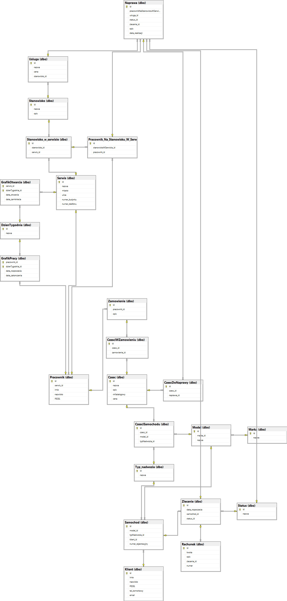

## MSSQL
MSSQL stands for Microsoft SQL Server. 
It is a relational database management system and a product of Microsoft

## T-SQL
The data held in relational databases is managed by Structured Query Language (SQL), a language used to communicate with the databases. 
T-SQL (Transact-SQL) is a proprietary procedural language of Microsoft which adds __transactional control__, __error and exception handling and block execution__ abilities to SQL.

## Database prototype for Car Service Network (Sieć Warsztatów)

Database was part of a project carried out in cooperation with D. Podolak & D. Sobstyl

Project included: 
* database design (structured entity relationship model) for provided business analysis 
* drawing a model of database in draw.io 
* transfering draw.io model to mssql  (hosted on azures services & locally)
* implementation of: procedures, functions and triggers according to the requirements

